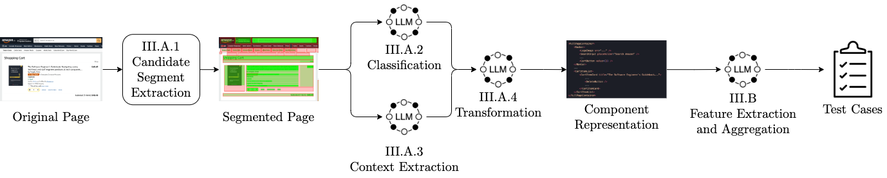

# VISCA
Source code for the paper "VISCA: Inferring Component Abstractions for Automated End-to-End Testing."

## Usage
Before running the project, you need to set the Google GenAI API key variable in the .env file (`GEMINI_API_KEY`).

After setting the variables, you can run the `model_to_component` notebook for converting the HTML into the component representation and the `component_feature_extraction` for extracting application features.

## Prompts
You can view the prompts utilized for the LLM [here](visca/prompts.py).

## Components
The list of UI component templates used for abstraction:
1. Typography
2. Image
3. Video
4. Icon
5. Navbar
6. Sidebar
7. Menu
8. Dropdown
9. Tabs
10. Breadcrumbs
11. Pagination
12. Button
13. Link
14. Form
15. Input
16. TextArea
17. Select
18. Checkbox
19. Radio
20. Switch
21. Slider
22. Label
23. TimePicker
24. DatePicker
25. Transfer
26. TreeSelect
27. AutoComplete
28. Upload
29. Card
30. List
31. Tree
32. Table
33. Avatar
34. Badge
35. Progress
36. Alert
37. Toast
38. Tooltip
39. Carousel
40. Accordion
41. Skeleton
42. Chip
43. Spinner
44. Timeline
45. Modal
46. Dialog
47. Popover
48. Chart
49. Map
50. Calendar